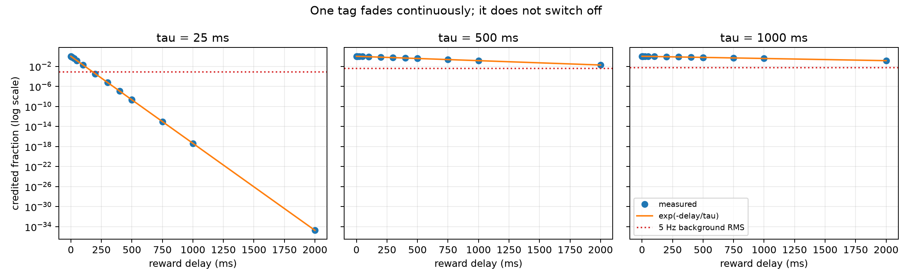

# What the ladder showed (remediated, t_26f59ce3)

Nora's review (t_a0a9775c) was right. The first version of rungs 1-3 never ran a real neuron: it handed each rung its answer and checked the arithmetic. That version is deleted. Rungs 1-3 now run tiny real spiking circuits, one millisecond at a time. A separate checker that shares no code with the simulator recomputes every weight by hand from the recorded spike times and replays every spike. We also broke the simulator on purpose in five ways: wrong sign, reward one step late, reward before the tag, crossed wires, and reward reaching every synapse. The checker caught all five.

Results come from code commit `b182450`, 10 seeds, `python run_ladder.py` (909 s on the Mac Mini). The worst hand-vs-simulator weight error was 1.8e-14 mV, with 0 spike mismatches.

| Step | Result | One-sentence answer |
|---|---:|---|
| One fading record | PASS | Unchanged: after delay `d` the record is exactly `exp(-d/tau)`, and it never switches off; with the stated 5 Hz background model it falls below the background RMS at about 178 ms (`tau=25`), 2.82 s (`tau=500`), and 5.28 s (`tau=1000`). |
| One synapse | PASS | Rewarding the output neuron's own spikes grew the synapse and made it fire more than its frozen twin on every seed (+65 to +93 spikes in 10 s, vs 70-107 for the frozen twin); punishing its spikes did the opposite (-42 to -67), no reward changed nothing exactly, and random-sign reward did roughly nothing (-4 to +3). |
| Two synapses | PASS, with leakage | The synapse whose input caused the rewarded spikes grew 4.0-4.8 mV, but the bystander also grew 1.3-1.7 mV because it happened to be active when those spikes fired; its share rises with its firing rate and the reward delay, and reaches parity at 50 Hz. |
| Tiny circuits | PASS | Reward at the end of a chain strengthened both links and raised the end's firing; in a parallel circuit both active branches grew, a wired but silent branch stayed exactly unchanged, and a disconnected pair that fires together still changed under reward, about as much as under shuffled reward. |

"Learning" at each step required two things across 10 seeds. (1) Every weight matched the independent hand calculation. (2) Output firing moved in the rewarded direction against a frozen twin driven by the identical held-out input, and by more than the shuffled-reward and random-sign-reward controls moved it.

## Three things we learned that the first version hid

1. **Subtracting the expected reward did not stop runaway.** Raw self-reward pinned the synapse at its 20 mV maximum on 10/10 seeds within about 40 s. With the running average subtracted, it still reached the maximum on 10/10 seeds, only later (about 55 s). The reason: when the reward is "you fired", it is perfectly correlated with the tag it multiplies. Subtracting an average removes the steady part of the reward but not that correlation. The first version said the baseline "stabilizes"; that was an artifact of the fake construction.
2. **"Which synapse deserves credit" leaks.** Credit follows timing coincidence, not cause. A synapse that merely fired alongside the real cause gets about one third of the credit at 20 Hz, rising to parity at 50 Hz, and the share grows with reward delay. The full map is in `summary.json` (`rung_2.leakage_map`).
3. **Reward for silence does nothing.** If the neuron never fires there is no tag, so a positive reward for silence leaves the weight exactly unchanged; this is confirmed. If the neuron fires occasionally, "reward silence" actually raised the weight. Teaching silence needs a different operation, punishing unwanted spikes, and that is what we used.

## Florian 2007, rerun with a paired "no learning" twin

Every seed now runs twice with identical inputs and starting weights: once learning, once frozen. Commit `b182450`, `python run_florian_anchor.py --seeds 20 --epochs 200 --workers 5`, 160 runs, 705 s. (Provenance repair: an earlier version of this line said `--workers 6`, copied from a hard-coded string in the script. The run actually used 5 workers. Nothing was rerun, and the worker count does not affect results.) This is our own NumPy rebuild of the paper's equations. It is **not** the repository's network code.

| Task | Rule | Learning twin passes | Frozen twin passes | Paper | Learning moved the gate the right way |
|---|---|---:|---:|---:|---:|
| Rate XOR | MSTDP | 20/20 | 0/20 | 99.1% | 20/20 seeds |
| Rate XOR | MSTDPET | 19/20 | 0/20 | 98.2% | 20/20 seeds |
| Temporal XOR | MSTDP | 20/20 | 16/20 | 89.7% | 17/20 seeds (2 same, 1 worse) |
| Temporal XOR | MSTDPET | 20/20 | 16/20 | 99.5% | 20/20 seeds |

What this means:

- **Rate XOR is real learning.** Without learning it never passes; with learning it almost always does.
- **Temporal XOR mostly passes without any learning.** 16 of 20 untouched networks already pass the paper's test. Learning widens the margin (median +10 Hz and +23 Hz), but "20/20 pass" alone is not evidence of learning for this task.
- **New symbol pairs (the paper's generalization claim) have now actually been run.** After training, with synapses fixed, trained networks passed on 192/200 (MSTDP) and 189/200 (MSTDPET) brand-new symbol pairs. Frozen networks passed on 179/200. Learning improved the median margin on new pairs for 18/20 and 17/20 seeds. So the generalization holds, but most of it was already there before learning.
- **New discrepancy (rate MSTDP).** The paper says rate-XOR performance "remained constant" once reward was removed and synapses were fixed. For MSTDPET this held: 190/200 fixed-synapse retests passed. For MSTDP it did **not**: only 87/200 passed, and 10 of 20 seeds failed all ten retests. For example, seed 1 fired 64 Hz on {1,1} in its last training epoch but 320 Hz once frozen. Our best guess (inferred, not yet tested) is that without an eligibility trace these networks pass during training only because each unwanted spike is punished on the spot. The final weights then depend on which pattern happened to come last. This is either a remaining difference from the author's implementation or a claim that holds only for MSTDPET. It is recorded, not tuned away.

## Why Track 1 did not answer the Florian question (unchanged)

The old Track 1 NULL means our old protocol failed, not Florian's rule. That protocol rewarded once, at the end of each 500 ms trial, and used two outputs with an argmax. It also redrew the input every trial, reset the memory every trial, and used different scales.

## What is still not shown

- None of this runs the repository's own network code (`snn/core.py`). Only its eligibility decay is cross-checked, at rung 0.
- Twenty seeds can detect a gross failure but cannot tell 98% from 100%.
- Rung 4 (back to XOR on our own network) has not started. It waits for Nora's re-review.

Details: `LADDER_REPORT.md`, `summary.json`, `../results_florian_anchor/FLORIAN_ANCHOR_REPORT.md`, `../docs/FLORIAN_DIFFERENCE_TABLE.md`.
